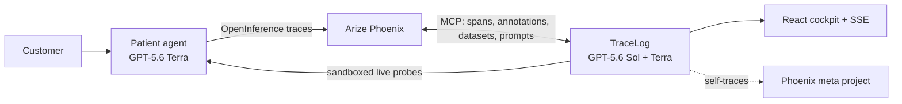

# TraceLog — continuous reliability for AI agents

> Agents fail silently. TraceLog turns their traces into verified fixes.

TraceLog supervises production AI agents through Arize Phoenix. It detects unsupported
answers and tool failures, explains the causal chain, proposes an auditable remediation,
generates evaluation cases, tests a prompt candidate on the real agent, replays the original
failure, and finishes with newly generated holdout attacks.

The reasoning core uses OpenAI GPT-5.6 through the Responses API. Quality-critical analysis
defaults to `gpt-5.6-sol`; repeated evaluation and Patient calls default to
`gpt-5.6-terra`. Responses are not stored by OpenAI unless explicitly enabled.

## Supervision loop

```text
watch → diagnose → root cause → remediation → synthesize → evaluate baseline
      → patch → evaluate candidate → replay → unseen holdout red-team
```

| Stage | Output |
|---|---|
| Watch | A fresh, deduplicated Phoenix trace |
| Diagnose | Structured verdict, confidence, severity, and span annotation |
| Root cause | Culprit, evidence, causal chain, and contributing factors |
| Remediation | Typed plan for prompt, code, tool, data, or configuration work |
| Synthesize | Adversarial regression dataset stored in Phoenix |
| Evaluate | Live baseline and candidate pass rates plus token/latency deltas |
| Patch | Candidate system prompt, unified diff, and Phoenix prompt version |
| Replay | Before/after judgment for the exact production failure |
| Red-team | Fresh holdout probes, similarity-filtered from the development eval set |

Non-prompt remediations are plans, not silent production mutations. They are marked as
requiring approval. Prompt candidates are evaluated and reported but are not auto-promoted.

## Architecture

The Patient and TraceLog are separate services. The Patient exports OpenInference traces to
Phoenix; TraceLog observes those traces through the Phoenix MCP server. Evaluation, replay,
and red-team use the Patient's documented HTTP adapter contract with `session_id="test"`.
The Watcher excludes those test spans to prevent recursive supervision.



See [architecture](docs/ARCHITECTURE.md), [system design](docs/SYSTEM_DESIGN.md), and
[bring-your-own-agent workflows](docs/WORKFLOWS.md).

## Run locally

Python 3.11+ and Node.js are required.

```bash
python3 -m venv .venv
.venv/bin/pip install -e ".[dev]"
cp .env.example .env
# Add OPENAI_API_KEY and Phoenix configuration to .env.

.venv/bin/uvicorn patient.agent:app --port 8082 --reload
.venv/bin/uvicorn dashboard.main:app --port 8085 --reload
.venv/bin/python scripts/run_pipeline.py
```

Open `http://localhost:8085`. The React application in `web/` is the primary cockpit when
`web/dist` exists. The no-build fallback is available at `/cockpit`.

Settings are process-cached. Restart both servers after changing `.env`.

### Offline judge fixture

Judges can explore the complete cockpit without API credentials or model spend. This mode
plays deterministic sample artifacts through the real SSE/UI path; it never calls OpenAI,
the Patient, or Phoenix and is prominently labelled as fixture data.

```bash
cp .env.example .env
# Set OFFLINE_DEMO_MODE=true in .env. API key placeholders may remain unchanged.
.venv/bin/uvicorn dashboard.main:app --port 8085
```

Open `http://localhost:8085`, then click **Play offline fixture**. Set
`OFFLINE_DEMO_MODE=false` and restart the process before any live GPT-5.6 run. See the
[judge testing guide](docs/JUDGE_TESTING.md) for both paths.

For a public deployment, configure the same `REPLAY_SHARED_SECRET` on TraceLog and the
Patient. It protects the system-prompt override used by test-only probes.

## Verify

```bash
.venv/bin/pytest -q
.venv/bin/ruff check tracelog patient dashboard tests
cd web && npm ci && npm run build
```

The offline tests mock model and MCP calls. A live end-to-end run additionally requires an
OpenAI key, a Phoenix project/API key, and a reachable Patient service.

GitHub Actions runs the same Python quality checks, React build, and production npm audit on
every push and pull request. Dependabot checks Python and web dependencies weekly.

## Configuration

| Variable | Default | Purpose |
|---|---|---|
| `OPENAI_API_KEY` | — | Required model credential |
| `OPENAI_MODEL` | `gpt-5.6-sol` | Diagnosis, root cause, remediation, synthesis, patching |
| `EVALUATOR_MODEL` | `gpt-5.6-terra` | Repeated judging and holdout generation |
| `PATIENT_MODEL` | `gpt-5.6-terra` | Supervised demo agent |
| `OPENAI_STORE_RESPONSES` | `false` | Opt in to OpenAI response storage |
| `DEMO_EVAL_CASES` | `4` | Cases per fast baseline/candidate demo evaluation |
| `REDTEAM_HOLDOUT_CASES` | `6` | Fresh post-patch attacks requested |
| `OFFLINE_DEMO_MODE` | `false` | Play labelled fixture events without external API calls |
| `STATE_BACKEND` | `firestore` | `firestore` or local state |
| `PATIENT_ENDPOINT` | `http://localhost:8082/chat` | Generic supervised-agent adapter |

See [.env.example](.env.example) for the complete list.

## Developer interfaces

- `tracelog-mcp`: published MCP tools for diagnosis, eval synthesis, prompt proposals,
  regression gating, full supervision, and self-evaluation.
- `tracelog-gate`: CI command that evaluates a prompt against JSON cases and exits nonzero
  below the requested threshold.
- `POST /selfeval`: grades TraceLog's own diagnostic classifier against labeled traps.
- `reports/<incident-id>.md`: evidence-backed postmortem produced after a complete loop.

## Repository map

```text
tracelog/   supervision stages, OpenAI gateway, Phoenix gateway, MCP server
patient/     deliberately fragile reference agent and tools
dashboard/   FastAPI API, SSE stream, and no-build cockpit
web/         React/Vite production cockpit
deploy/      Cloud Run container and deployment automation
tests/       offline unit and contract tests
```

Apache-2.0 licensed.
