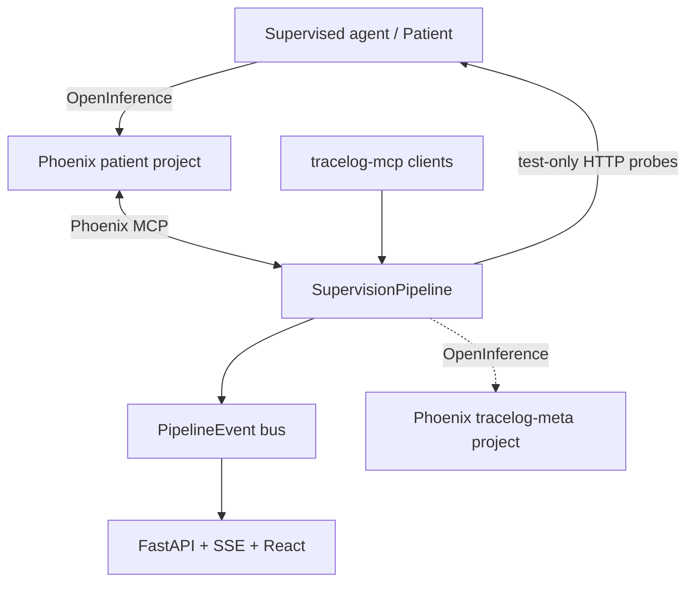

# TraceLog architecture

Status: as built on 2026-07-21.

## Boundaries

TraceLog supervises an agent through observability. It does not import or invoke Patient
implementation code. Production traces flow from the Patient to Arize Phoenix; TraceLog
reads and writes Phoenix artifacts through `tracelog/phoenix_mcp.py`.

The only direct runtime integration is the generic HTTP adapter in
`tracelog/patient_client.py`, used for evaluation, replay, and red-team. These requests use
`session_id="test"`; `Watcher` excludes their spans, preventing a feedback loop. A shared
secret protects system-prompt overrides in public deployments.

## Pipeline

`SupervisionPipeline.run_once()` handles at most one fresh incident per call.

1. `Watcher` polls spans after a durable cursor and deduplicates span IDs.
2. `Diagnostician` returns a typed verdict and annotates confident failures.
3. `RootCauseAnalyst` produces evidence, culprit, causal chain, and fix strategy.
4. `RemediationPlanner` classifies the engineering action and records approval needs.
5. `Synthesizer` derives a development evaluation set and uploads it to Phoenix.
6. `Evaluator` runs a bounded live baseline evaluation.
7. `Patcher` proposes and versions a candidate prompt with a unified diff.
8. `Evaluator` scores the candidate against the same development cases.
9. `TraceReplay` repeats the exact production input before and after the candidate.
10. `RedTeam` generates new, similarity-filtered holdouts and runs both prompts.
11. `report.py` writes a Markdown postmortem.

One mutable `Incident` model carries evidence and artifacts across every stage. Each module
takes and returns that incident, while `PipelineEvent` is the stable dashboard contract.

## Model runtime

All TraceLog model calls go through `tracelog/llm.py` and the OpenAI Responses API.
Pydantic models define structured outputs. `gpt-5.6-sol` is the default for complex,
quality-critical reasoning; `gpt-5.6-terra` is used for repeated evaluator and Patient calls.
Reasoning effort is explicit per role. OpenAI response storage defaults off.

The Patient implements its function-calling loop with Responses API function tools. When
storage is disabled, it replays response output items and appends `function_call_output`
items on subsequent turns.

## Safety and promotion

- Code, tool, data, and configuration remediation plans require human approval.
- Prompt candidates are tested but never silently promoted to production.
- Red-team holdouts are generated after patching and filtered against development cases.
- Execution errors are counted separately and rendered in the dashboard.
- Patient overrides require the test session and, in public deployments, a shared secret.
- Customer-bearing Responses are not stored by OpenAI by default.

## State and deployment

`tracelog/state.py` supports Firestore for durable production cursor/dedupe state and a
local JSON backend for development. The dashboard and Patient are FastAPI services deployed
with the Cloud Run container in `deploy/`. The obsolete Vertex Agent Engine/ADK wrapper has
been removed; orchestration is ordinary async Python and is portable across runtimes.
